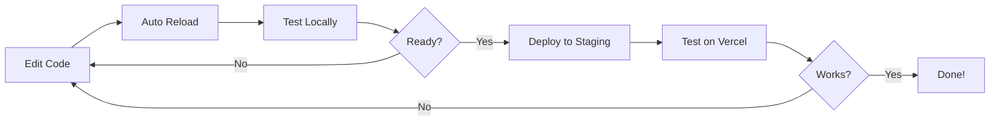

# Local Development Setup Guide

## Prerequisites
✅ Node.js installed
✅ npm dependencies installed (`npm install`)
✅ Vercel deployment completed

## Environment Configuration

Your project uses **`.env.local`** for local development. This file is already set up and gitignored (which is correct for security).

### Environment Files Overview:
- **`.env.local`** - Your local development environment (active for `npm run dev`)
- **`.env.staging`** - Staging environment config (used by Vercel)
- **`.env.example`** - Template file with example values
- **`.env.docker`** - Docker-specific configuration

## Quick Start

### 1. Start the Development Server

```bash
npm run dev
```

This will:
- Start Vite development server
- Use environment variables from `.env.local`
- Hot-reload on file changes
- Typically run on `http://localhost:5173`

### 2. Alternative: Use the Local Dev Script

```bash
npm run dev:local
```

This uses the `scripts/dev.sh` script for additional setup if needed.

## What's Different Between Local and Staging?

| Aspect | Local Dev | Staging (Vercel) |
|--------|-----------|------------------|
| **Supabase Project** | Local project | Staging project |
| **URL** | localhost:5173 | sasha-staging.vercel.app |
| **Environment** | `.env.local` | Vercel env vars |
| **Hot Reload** | ✅ Yes | ❌ No (requires redeploy) |

### Your Current Setup:

**Local Development** (`.env.local`):
- Uses your **local Supabase instance**
- URL: `https://xcwlvoqccyxnldyznxln.supabase.co`

**Staging** (Vercel):
- Uses your **staging Supabase instance**
- URL: `https://eocxtwjcwpgipfeayvhy.supabase.co`

## Common Development Commands

```bash
# Start development server
npm run dev

# Build for production (test build locally)
npm run build

# Preview production build locally
npm run preview

# Run linter
npm run lint

# Deploy to staging (from local)
npm run deploy:staging
```

## Troubleshooting

### Port Already in Use
If port 5173 is busy:
```bash
# Vite will automatically try the next available port (5174, 5175, etc.)
```

### Environment Variables Not Loading
1. Ensure `.env.local` exists in the root directory
2. Restart the dev server after changing env vars
3. Check that variables are prefixed with `VITE_` for frontend access

### Database Connection Issues
- Verify your Supabase URL and anon key in `.env.local`
- Check Supabase project is active at https://supabase.com/dashboard

## Next Steps

1. **Start coding!** The dev server will hot-reload your changes
2. **Test locally** before deploying to staging
3. **Deploy to staging** when ready: `npm run deploy:staging`
4. **Monitor Vercel** for deployment status

## Development Workflow



---

**Ready to start?** Run `npm run dev` and open your browser! 🚀
