# Development Workflow Guide

## 🔄 Complete Development Pipeline

```mermaid
graph LR
    A[Antigravity<br/>Local Development] --> B[GitHub Desktop<br/>Commit & Push]
    B --> C[GitHub<br/>master branch]
    C --> D[Vercel<br/>Auto-Deploy]
    D --> E[Staging URL<br/>yourapp.vercel.app]
    E --> F[Supabase<br/>Database]
    
    style A fill:#4285f4
    style C fill:#181717
    style D fill:#000000
    style F fill:#3ecf8e
```



---

## 📋 Quick Reference Workflow

### The 7-Step Development Cycle

1. **Edit code in Antigravity** (with AI help)
2. **Save files** (Ctrl+S)
3. **Open GitHub Desktop**
4. **Commit changes** (write what you changed)
5. **Push to origin/master**
6. **Wait 30 seconds** (Vercel deployment)
7. **Check staging URL** → Repeat

---

## 🛠️ Tools in Your Stack

| Tool | Purpose | Status |
|------|---------|--------|
| ✅ **Antigravity** | AI-assisted coding environment | Active |
| ✅ **GitHub Desktop** | Git commits and push | Configured |
| ✅ **GitHub** | Code repository (`rouf-zorgit/SashaAI`) | Connected |
| ✅ **Vercel** | Automatic deployment & hosting | Configured |
| ✅ **Supabase** | Database & backend services | Connected |

---

## 📝 Detailed Step-by-Step Guide

### Step 1: Code in Antigravity

**Location:** `c:\Users\abdur\.gemini\finAI - MVP`

- Work on your project files locally
- Use Gemini/Claude AI assistance within Antigravity
- Make changes to:
  - Frontend code (`src/` directory)
  - Supabase functions (`supabase/functions/`)
  - Configuration files
  - Documentation

**Tips:**
- Use AI to help write, debug, and optimize code
- Test locally first with `npm run dev`
- Keep changes focused and atomic

---

### Step 2: Save Your Work

- Save all modified files (Ctrl+S or Cmd+S)
- Verify changes are saved before committing

---

### Step 3: Open GitHub Desktop

**Current Git Configuration:**
- **Repository:** `https://github.com/rouf-zorgit/SashaAI.git`
- **Branch:** `master`
- **Remote:** `origin`

**What GitHub Desktop Shows:**
- All modified files
- Added files (green +)
- Deleted files (red -)
- Modified files (yellow dot)

---

### Step 4: Commit Changes

**In GitHub Desktop:**

1. Review the changed files in the left panel
2. Check the diff view to verify changes
3. Write a clear commit message:

**Good Commit Messages:**
```
✅ Add user authentication flow
✅ Fix chat auto-scroll issue
✅ Update Supabase Edge Function for LTM
✅ Refactor transaction confirmation UI
```

**Bad Commit Messages:**
```
❌ Update
❌ Fix stuff
❌ Changes
❌ WIP
```

**Commit Message Template:**
```
[Type] Brief description

- Detail 1
- Detail 2
- Detail 3
```

**Types:**
- `feat:` New feature
- `fix:` Bug fix
- `refactor:` Code restructuring
- `docs:` Documentation
- `style:` UI/CSS changes
- `perf:` Performance improvement

---

### Step 5: Push to GitHub

**In GitHub Desktop:**

1. Click **"Push origin"** button (top right)
2. Wait for push to complete
3. Verify success message

**Command Line Alternative:**
```bash
git add .
git commit -m "Your commit message"
git push origin master
```

---

### Step 6: Vercel Auto-Deployment

**What Happens Automatically:**

1. Vercel detects push to `master` branch
2. Starts build process
3. Runs: `npm run build`
4. Deploys to staging URL
5. **Typical deployment time:** 30-60 seconds

**Monitor Deployment:**
- Visit: https://vercel.com/dashboard
- Check deployment status
- View build logs if needed

**Build Configuration:**
```json
{
  "buildCommand": "npm run build",
  "outputDirectory": "dist",
  "framework": "vite"
}
```

---

### Step 7: Test on Staging

**Your Staging URL:**
- Check Vercel dashboard for your staging URL
- Format: `https://[your-project]-[random].vercel.app`

**Testing Checklist:**
- ✅ Page loads correctly
- ✅ No console errors
- ✅ Features work as expected
- ✅ Supabase connection active
- ✅ Chat functionality working
- ✅ UI looks correct

**If Issues Found:**
1. Note the bug/issue
2. Return to Step 1 (fix in Antigravity)
3. Repeat the cycle

---

## 🔧 Local Development Commands

### Start Development Server
```bash
npm run dev
```
- Runs on: `http://localhost:5173`
- Hot reload enabled
- Use for local testing before pushing

### Build for Production
```bash
npm run build
```
- TypeScript compilation
- Vite bundling
- Output to `dist/` directory

### Preview Production Build
```bash
npm run preview
```
- Test production build locally
- Runs on: `http://localhost:4173`

---

## 🗄️ Supabase Integration

### Edge Functions Location
```
supabase/functions/
├── processChat/
├── processChatDeep/
└── [other functions]
```

### Deploy Supabase Functions
```bash
# Deploy all functions
supabase functions deploy

# Deploy specific function
supabase functions deploy processChat
```

### Environment Variables
- **Local:** `.env.local`
- **Staging:** Set in Vercel dashboard
- **Supabase:** Set in Supabase dashboard

**Required Variables:**
```env
VITE_SUPABASE_URL=your_supabase_url
VITE_SUPABASE_ANON_KEY=your_anon_key
```

---

## 🚨 Troubleshooting

### Deployment Fails

**Check:**
1. Build logs in Vercel dashboard
2. TypeScript errors: `npm run build` locally
3. Environment variables are set
4. `.env` files are not committed (in `.gitignore`)

**Common Issues:**
- Missing environment variables
- TypeScript compilation errors
- Import path issues
- Missing dependencies

### GitHub Push Fails

**Solutions:**
```bash
# Pull latest changes first
git pull origin master

# Resolve conflicts if any
# Then push again
git push origin master
```

### Vercel Not Deploying

**Verify:**
1. Vercel is connected to your GitHub repo
2. Auto-deploy is enabled for `master` branch
3. Build command is correct
4. No build errors

---

## 📊 Development Best Practices

### 1. Commit Often
- Make small, focused commits
- Commit after completing a feature or fix
- Don't accumulate too many changes

### 2. Test Locally First
```bash
npm run dev        # Test in development
npm run build      # Verify build works
npm run preview    # Test production build
```

### 3. Use Branches for Big Features
```bash
# Create feature branch
git checkout -b feature/new-feature

# Work on feature
# Commit changes

# Merge back to master when ready
git checkout master
git merge feature/new-feature
git push origin master
```

### 4. Monitor Deployments
- Check Vercel dashboard after each push
- Review build logs for warnings
- Test staging URL before considering complete

### 5. Keep Dependencies Updated
```bash
npm outdated       # Check for updates
npm update         # Update packages
```

---

## 🎯 Quick Commands Reference

### Git Commands
```bash
git status                    # Check status
git add .                     # Stage all changes
git commit -m "message"       # Commit changes
git push origin master        # Push to GitHub
git pull origin master        # Pull latest changes
git log --oneline -10         # View recent commits
```

### NPM Commands
```bash
npm run dev                   # Start dev server
npm run build                 # Build for production
npm run preview               # Preview production build
npm install                   # Install dependencies
npm run lint                  # Run linter
```

### Supabase Commands
```bash
supabase functions deploy     # Deploy all functions
supabase functions list       # List functions
supabase db push              # Push database changes
supabase db pull              # Pull database schema
```

---

## 🔄 Complete Workflow Example

### Scenario: Fix a bug in the chat feature

1. **Antigravity:** Open `src/pages/Chat.tsx`
2. **Antigravity:** Fix the auto-scroll issue with AI help
3. **Save:** Ctrl+S to save the file
4. **GitHub Desktop:** See `Chat.tsx` in changed files
5. **GitHub Desktop:** Write commit: `fix: resolve chat auto-scroll issue`
6. **GitHub Desktop:** Click "Commit to master"
7. **GitHub Desktop:** Click "Push origin"
8. **Wait:** 30-60 seconds for Vercel deployment
9. **Test:** Visit staging URL and test chat
10. **Verify:** Auto-scroll now works correctly ✅

**If bug persists:**
- Return to Step 1
- Debug further
- Repeat cycle

---

## 📈 Monitoring & Analytics

### Vercel Dashboard
- Deployment history
- Build logs
- Performance metrics
- Error tracking

### Supabase Dashboard
- Database queries
- Edge Function logs
- API usage
- Authentication logs

### Local Development
- Browser DevTools console
- Network tab for API calls
- React DevTools for component state

---

## 🎓 Tips for Success

### DO ✅
- Commit frequently with clear messages
- Test locally before pushing
- Monitor Vercel deployments
- Keep environment variables synced
- Document significant changes

### DON'T ❌
- Commit `.env` files (use `.env.example` instead)
- Push broken code to master
- Skip testing on staging
- Make huge commits with many changes
- Ignore build warnings

---

## 📞 Need Help?

### Resources
- **Vercel Docs:** https://vercel.com/docs
- **Supabase Docs:** https://supabase.com/docs
- **Vite Docs:** https://vitejs.dev
- **React Docs:** https://react.dev

### Common Questions

**Q: How long does deployment take?**
A: Typically 30-60 seconds from push to live

**Q: Can I rollback a deployment?**
A: Yes, in Vercel dashboard → Deployments → Click previous deployment → Promote to Production

**Q: How do I see build errors?**
A: Vercel dashboard → Deployments → Click failed deployment → View logs

**Q: Where are environment variables set?**
A: Vercel dashboard → Project Settings → Environment Variables

---

## 🚀 You're All Set!

Your development pipeline is ready:
- ✅ Local development in Antigravity
- ✅ Version control with GitHub
- ✅ Automatic deployment via Vercel
- ✅ Backend powered by Supabase

**Start coding and let the automation handle the rest!**
